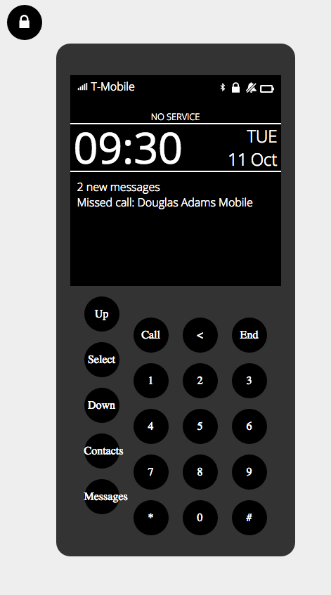

# react-phone

I'm just learning react and building the interface for a phone.

## Bootstrapped With Create React App

This project was bootstrapped with [Create React App](https://github.com/facebookincubator/create-react-app).

Below you will find some information on how to perform common tasks.  
You can find the most recent version of this guide [here](https://github.com/facebookincubator/create-react-app/blob/master/packages/react-scripts/template/README.md).

## Todo

### Features

- [x] Build all the buttons and lay them out
- [x] Build outline around the phone
- [x] Add the "NO SERVICE" message
- [ ] Make sure the "NO SERVICE" message doesn't push anything down
- [ ] Build the Messages Menu
- [ ] Build the Missed Calls Menu
- [ ] Build the Settings Menu
- [ ] Make the lock button turn the screen off and on as well
- [ ] Make the signal icon change according to signal strength
- [ ] Make the battery icon  change according to battery level and turn red when low
- [ ] Have controls outside the phone to control signal, battery, calls, and messages received
- [ ] Add ability to type messages
- [ ] Add ability to send messages
- [ ] Add loading screen and show it for a split second between the alert and other after sent screen
- [ ] Add functionality to the down button - on the home screen, if there are notifications, the down button shows a screen with the notifications
- [ ] Add incoming call, current call, and ended call screen

### Technology

- [ ] Use Redux
- [ ] Add tests
